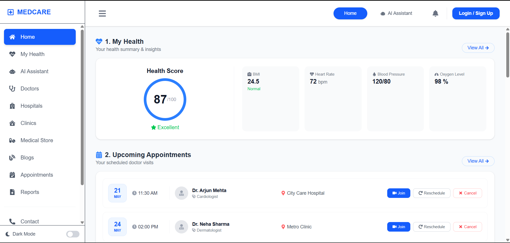
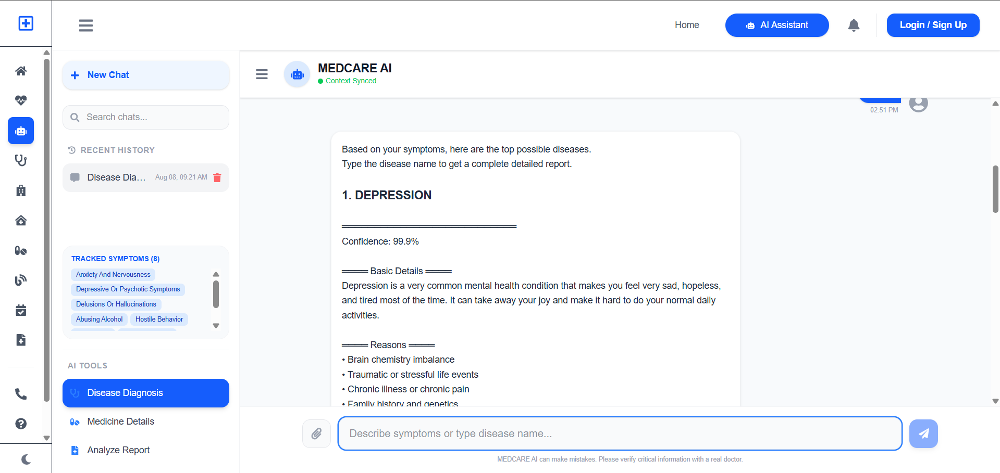
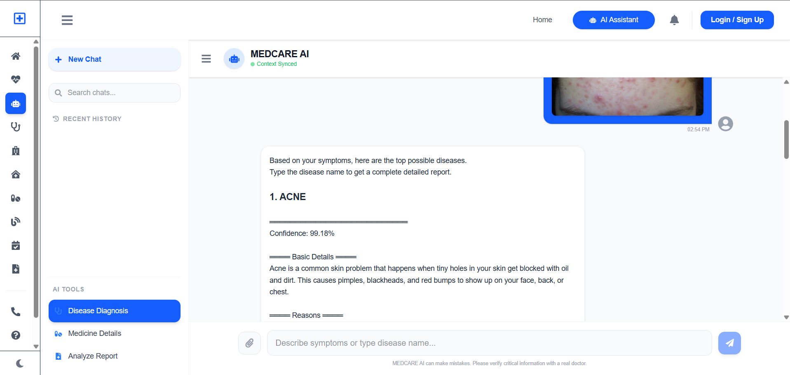
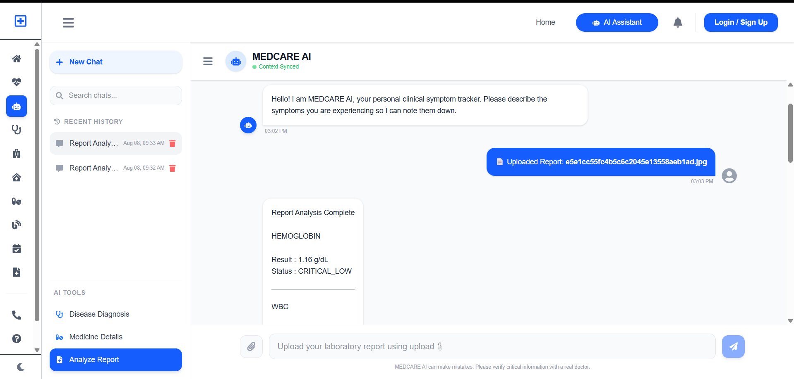

# MedCare – Smart AI Healthcare Companion

MedCare is a full-stack AI-powered healthcare platform and your health manager, designed to provide users with intelligent and accessible healthcare assistance through disease prediction, skin disease detection, medicine information, medical report analysis, doctor recommendations and many more.

## Features

- Symptom-based disease prediction with confidence scores
- Skin disease detection using image-based classification
- Medicine search and detailed medicine information
- Medical report analysis from PDF and image files
- Multilingual interaction supporting English, Hindi, and Hinglish for symptoms
- AI-powered healthcare chatbot to help you
- Doctor, hospital, and clinic recommendations nearby
- Health update , regular reminder of medicines and appointments.
- Directly appoint a doctor for checkup
- Budget-oriented healthcare support

## AI & Machine Learning

- XGBoost – Symptom-based disease prediction
- EfficientNet-B0 – Skin disease classification
- Gemini Flash Lite – Natural language understanding and response generation
- scispaCy – Biomedical text processing
- RapidFuzz – Symptom matching and normalization
- EasyOCR – Text extraction from medical reports
- pdfplumber – PDF text extraction

## Technology Stack

### Frontend
- React.js
- JavaScript
- HTML5
- CSS3

### Backend
- FastAPI
- Node.js
- REST APIs
- JWT Authentication

### Database & Knowledge Base
- MongoDB
- SQLite
- JSON-based knowledge bases

### Development Tools
- Git & GitHub
- Visual Studio Code
- Postman
- Jupyter Notebook

## System Modules

### 1. Disease Prediction
Users can enter symptoms in natural language. The system processes the input, maps the symptoms to supported features, and uses an XGBoost model to generate disease predictions with confidence scores.

### 2. Skin Disease Detection
Users can upload a skin image. The image is preprocessed and passed through an EfficientNet-B0 based classification model to predict the skin disease class.

### 3. Medicine Information
Users can search for medicines and retrieve relevant information from the medicine database, including available details and usage-related information.

### 4. Medical Report Analysis
The report analyzer accepts PDF or image-based medical reports and extracts relevant information using pdfplumber and EasyOCR. Extracted values are parsed, normalized, and compared with reference information.

### 5. AI Healthcare Assistant
The platform provides conversational assistance using Gemini Flash Lite for natural-language understanding, follow-up questions, and response generation.

### 6. Doctor & Healthcare Services
The platform provides doctor, hospital, and clinic related information through backend APIs and database integration.

## Architecture

```text
User
  ↓
React Frontend
  ↓
Backend APIs
  ↓
┌──────────────────────────────────────┐
│ Disease Prediction │ Skin Detection │
│ Medicine Search    │ Report Analysis│
│ AI Assistant       │ Doctor Services│
└──────────────────────────────────────┘
  ↓
ML Models + Databases + Knowledge Bases
  ↓
AI-Assisted Response
  ↓
React Frontend
```

## Live Website

[Visit MedCare](https://medcare-opal.vercel.app/)

## Screenshots

### Home Page


### Symptom Checker


### Skin Disease Detection


### Medical Report Analysis


### Medicine Store

